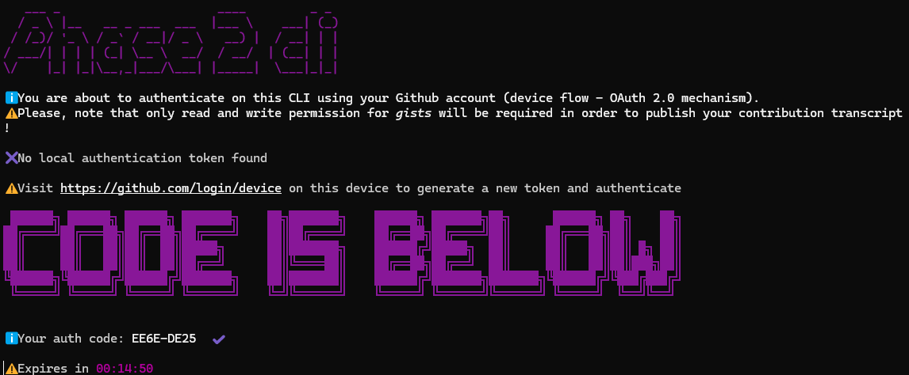
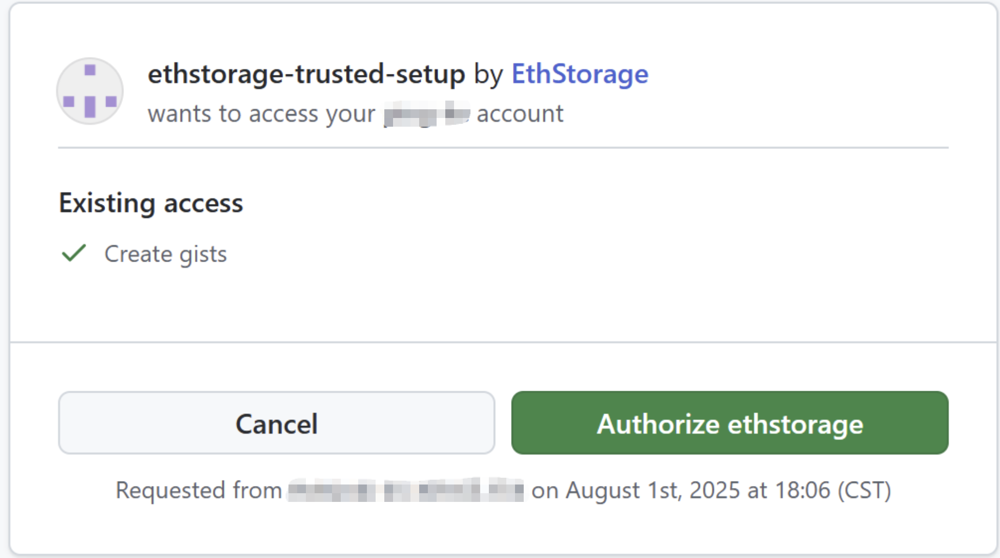

# Overview
Thank you for contributing to EthStorage’s trusted setup ceremony! This is the trusted setup for our groth16 zk-SNARK to blob_poseidon circuits and will be used in the general purpose verifier contracts on mainnet.

This document will walk you through contributing to the EthStorage trusted setup ceremony. If you hit problems, you can also read the [p0tion team’s documentation](https://p0tion.super.site/ce8f7047468b41239dc512919644535c), which includes more details on how to contribute to p0tion-based ceremonies like ours; you can also reach out to us [on Discord](https://discord.gg/xhCwaMp7ps), we are happy to be of help. ☺️


## Prerequisites to contribute:
- A Linux or Mac system. For Windows users, please install [WSL2](https://learn.microsoft.com/en-us/windows/wsl/install) 
- A Github account: we are looking for active contributors, so be sure that on your GitHub account
  - Your account must be at least a month old;
  - You must have at least 1 public repository;
  - You must follow at least 5 Github accounts and have at least 1 follower;
  - You must be willing to give the ceremony tools permission to read and write GitHub Gists for this account.
- A strong internet connection. The most common cause of failures is an inability to upload your contribution to the ceremony before the timeout period expires. Please run the ceremony with a strong internet connection, and in particular one with good upload bandwidth. 
- Global Dependencies
  - Node.js version 18 or higher.
  - NPM version 9.2.0 or higher.


### Installing Global Dependencies‍
Running the CLI application to contribute to the ceremony requires Node.js version 18 or higher. An easy way to install dependencies is to use **Node Version Manager (NVM)**.

We’ll install nvm to change node versions by downloading a shell script using the following command in the terminal:
```bash
curl -o- https://raw.githubusercontent.com/nvm-sh/nvm/v0.39.7/install.sh | bash
source .bashrc
```
Then use the following commands to install and switch to Node.js 18.
``` bash
nvm install 18 
nvm use 18
```

## Contributing to the Ceremony‍
### Step 1 - Create a temporary directory
The first thing to do is to create a temporary directory (e.g. ~/trusted-setup-tmp) to run the ceremony from.
```bash
mkdir ~/trusted-setup-tmp && cd ~/trusted-setup-tmp
```

### Step 2 - Install phase2cli
To contribute to a ceremony, you will need to download the phase2cli package via the following command:
```bash
npm install -g @p0tion/phase2cli
``` 

### Step 3 - Authenticate with GitHub
As described above a GitHub account which meets certain [conditions](#prerequisites-to-contribute) is required to contribute. To authorize your account enter the following command:
```bash
phase2cli auth
``` 
This step will require you to open your web browser and visit https://github.com/login/device. 

Paste your auth code into the page, requesting permission from p0tion to use GitHub's "Gists" feature, and then click the "Authorize ethstorage" button to grant permission. 

GitHub will show you with a "Congratulations, you’re all set!" message, and you can return to the terminal.

### Step 4 - Contribute!
You’re ready to contribute to the ceremony. Back in the terminal, enter:
```bash
phase2cli contribute -c ethstorage-trusted-setup-ceremony
``` 
You'll need to provide your entropy (aka toxic waste) for your contribution. You could either choose to provide it manually or make the CLI automatically compute some random entropy for you.

Your entropy is the secret data for you to destroy and forget (or ideally never know) to secure the ceremony. If you choose to enter it manually, you can choose any letters, numbers or symbol on your keyboard and it can be of any length. No restrictions. 

Be patient!! This process can take time depending on your internet speed and the number of contributors waiting in line!

‍If you run into any errors or lose your connection, you can try to restart your contributions by rerunning the contribute command. Your contribution should continue where it last left off.

**Once your contribution is complete, you’ll be invited to share a message on Twitter/X — we encourage you to do so, or on whatever social media platform(s) you prefer! 🎉**

### Step 5 - Cleanup & Logout
After your ceremony contribution completes, it’s probably a good idea to clean up your files and the GitHub authorization by running the following commands in the terminal.
```bash
phase2cli clean
phase2cli logout
```
You can also delete the `~/trusted-setup-tmp` folder you created if you like.


## LINK
p0tion: https://p0tion.super.site/ce8f7047468b41239dc512919644535c